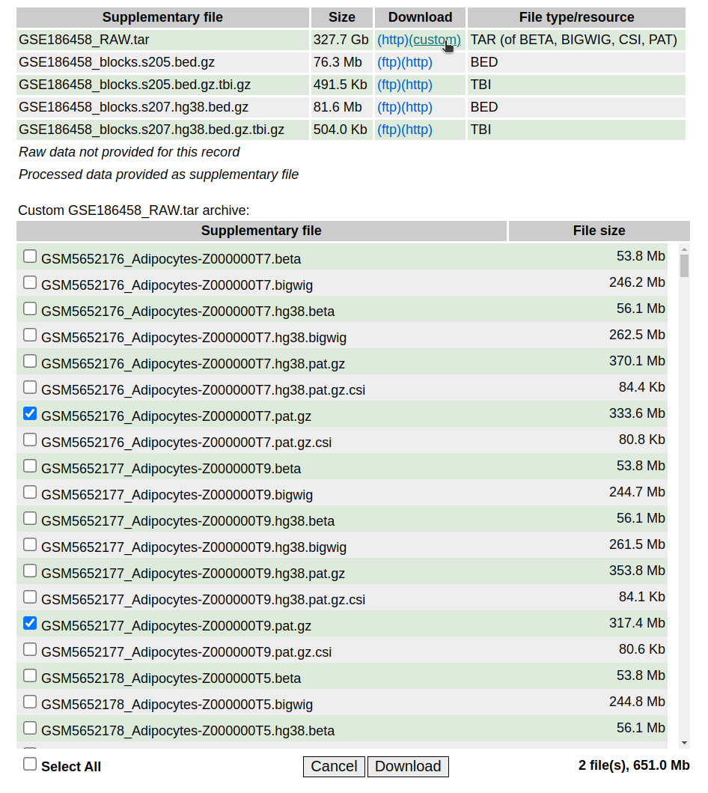

# Read simulation from the normal cell-type methylation atlas data [Loyfer et al., Nature 2023](https://doi.org/10.1038/s41586-022-05580-6).
[](https://doi.org/10.5281/zenodo.14025053)

We implemented python codes to simulate sequence reads from the normal cell-type methylation atlas data, primarily for running [**MethylBERT**](https://github.com/CompEpigen/methylbert).

## How to use
### Set-up
We provide `requirements.txt` and `Dockerfile` files for setting up the environment. Please follow the [Set-up](https://github.com/CompEpigen/methylseq_simulation?tab=readme-ov-file#set-up) section in our *methylseq_simulation* repo. 

### Data preparation
Please, note that our code requires running [wgbstools](https://github.com/nloyfer/wgbs_tools) for getting reference genomes and cpg locations prior execution. 

#### [Recomended]: Download using [geofetch](https://github.com/pepkit/geofetch) CLI.
1. Install geofetch following
2. Run the next code to selectively download correct `.pat` files:

For hg19
```
geofetch -i GSE186458 --processed --filter "Z[0-9A-Z]+\.pat\.gz$" \
  -m /path/to/your/metadata/folder \
  -g /path/to/your/data/folder
```
For hg38
```
geofetch -i GSE186458 --processed --filter "\.hg38\.pat\.gz$" \
  -m /path/to/your/metadata/folder \
  -g /path/to/your/data/folder
```
**Soem files may fail to download properly using this method and result in error during parsing. In such case targeted manual download is advised** 

#### [Alternative]: Manual download from GEO
You can download `.pat` files for the normal cell-type methylation atlas [GEO page](https://www.ncbi.nlm.nih.gov/geo/query/acc.cgi?acc=GSE186458). The `custom` button allows you to select files to download. 



### Simulate reads from the prepared data
1.[OPTIONAL] Create a `.txt` file including a list of files you want to process. **Please, do not change the input file names!!**  

```
> cat input.txt 
/home/GSE186458_normal_cell_atlas/data/pat/GSM5652285_Blood-T-CenMem-CD4-Z00000417.pat
/home/GSE186458_normal_cell_atlas/data/pat/GSM5652299_Blood-NK-Z000000TM.pat
/home/GSE186458_normal_cell_atlas/data/pat/GSM5652181_Saphenous-Vein-Endothel-Z000000RM.pat
/home/GSE186458_normal_cell_atlas/data/pat/GSM5652317_Blood-B-Z000000UB.pat

```
2. Save target genomic regions to simulate reads into .tsv or .csv file. In the next step, this file should be given with `-r` option.
To match regions from the paper, refer to [UXM repo](https://github.com/nloyfer/UXM_deconv/tree/main/supplemental).

```
> cat Atlas.U25.l4.hg38.full.tsv | awk '{ OFS="\t"; print $1, $2, $3, $4, $5, $6, $7, $8 }' | awk 'NR<=5'
chr     start   end     startCpG        endCpG  target  name    direction
chr1    1262136 1262432 24569   24584   Eryth-prog      chr1:1262136-1262432    U
chr1    2384160 2384745 63940   63960   Neuron  chr1:2384160-2384745    U
chr1    5950648 5950918 133709  133715  Epid-Kerat      chr1:5950648-5950918    U
chr1    5959258 5959335 133878  133884  Pancreas-Delta  chr1:5959258-5959335    U
```
3. Run the source code with the command line `python src/main.py [options]`.
```
python src/main.py -f input.txt -c 50 -o ./res/ --wgbstools_dir your/path/to/wgbstools --genome hg38 -r Atlas.U25.l4.hg38.full.tsv
```
Alternatively, you can provide a target directory path with all files to be processed or a single target file path

```
python src/main.py -f your/path/to/target/files -c 50 -o ./res/ --wgbstools_dir your/path/to/wgbstools --genome hg38 -r Atlas.U25.l4.hg38.full.tsv
```

### Example output
```
> head -n 3 GSM5652196_Pancreas-Endothel-Z00000430.hg38_reads.csv 
ref_name	ref_pos	original_seq	dna_seq	original_methyl	methyl_seq	dmr_label	dmr_ctype	dmr_coordinates	ctype
chr1	1262099	GCCCACCTCAGCCTCCCAAAGTGCTGGAATTACAGGCGTGAGCCACCGCGCCCGGCCGACCACTACTCACTCGGTGGTATATATTCTTCAGATCAGCTGAAGGCACACACAC	GCC CCC CCA CAC ACC CCT CTC TCA CAG AGC GCC CCT CTC TCC CCC CCA CAA AAA AAG AGT GTG TGC GCT CTG TGG GGA GAA AAT ATT TTA TAC ACA CAG AGG GGC GCG CGT GTG TGA GAG AGC GCC CCA CAC ACC CCG CGC GCG CGC GCC CCC CCG CGG GGC GCC CCG CGA GAC ACC CCA CAC ACT CTA TAC ACT CTC TCA CAC ACT CTC TCG CGG GGT GTG TGG GGT GTA TAT ATA TAT ATA TAT ATT TTC TCT CTT TTC TCA CAG AGA GAT ATC TCA CAG AGC GCT CTG TGA GAA AAG AGG GGC GCA CAC ACA CAC ACA CAC ACA CAC	CCCCCC	2222222222222222222222222222222222221222222222121222122212222222222222212222222222222222222222222222222222222222	0	Eryth-prog	chr1:1262136-1262432	Endothel
chr1	1262113	CCCAAAGTGCTGGAATTACAGGCGTGAGCCACCGCGCCCGGCCGACCACTACTCACTCGGTGGTATATATTCTTCAGATCAGCTGAAGGCACACACACGCATCGTAACAAGTACTTTAACACGCCCTGGACACCTGCTCCCGGGCCTTAT	CCC CCA CAA AAA AAG AGT GTG TGC GCT CTG TGG GGA GAA AAT ATT TTA TAC ACA CAG AGG GGC GCG CGT GTG TGA GAG AGC GCC CCA CAC ACC CCG CGC GCG CGC GCC CCC CCG CGG GGC GCC CCG CGA GAC ACC CCA CAC ACT CTA TAC ACT CTC TCA CAC ACT CTC TCG CGG GGT GTG TGG GGT GTA TAT ATA TAT ATA TAT ATT TTC TCT CTT TTC TCA CAG AGA GAT ATC TCA CAG AGC GCT CTG TGA GAA AAG AGG GGC GCA CAC ACA CAC ACA CAC ACA CAC ACG CGC GCA CAT ATC TCG CGT GTA TAA AAC ACA CAA AAG AGT GTA TAC ACT CTT TTT TTA TAA AAC ACA CAC ACG CGC GCC CCC CCT CTG TGG GGA GAC ACA CAC ACC CCT CTG TGC GCT CTC TCC CCC CCG CGG GGG GGC GCC CCT CTT TTA TAT	CCCCCCCCCC	222222222222222222222212222222221212221222122222222222222122222222222222222222222222222222222222212222122222222222222222212222222222222222221222222222	0	Eryth-prog	chr1:1262136-1262432	Endothel
```


### Source code usage 
```
> python3 src/main.py --help
usage: main.py [-h] [-o OUTPUT_DIR] [-c CORES] [-r F_REGION] [-g GENOME] -f
               F_INPUT

optional arguments:
  -h, --help            show this help message and exit
  -o OUTPUT_DIR, --output_dir OUTPUT_DIR
                        Directory to save the results (default: ./)
  -c CORES, --cores CORES
                        Number of cores for multiprocessing. A larger number
                        increases the computation speed. (default: 1)
  -r F_REGION, --f_region F_REGION
                        Selected regions for training MethylBERT. If not
                        given, it automatically selects regions for the given
                        files.
  -g GENOME, --genome GENOME
                        Reference genome (either hg19 or hg38). Currently only
                        hg19 is available. (default: hg19)
  -f F_INPUT, --f_input F_INPUT
                        Text file containing a list of .pat files OR path to a
                        .pat file
  -wd WGBSTOOLS_DIR --wgbstools_dir WGBSTOOLS_DIR 
                        The directory where wgbstools is installed. Only needed 
                        to be provided once per genome

```

## Citation
```
@article{jeong2025methylbert,
  title={MethylBERT enables read-level DNA methylation pattern identification and tumour deconvolution using a Transformer-based model},
  author={Jeong, Yunhee and Gerh{\"a}user, Clarissa and Sauter, Guido and Schlomm, Thorsten and Rohr, Karl and Lutsik, Pavlo},
  journal={Nature Communications},
  volume={16},
  number={1},
  pages={788},
  year={2025},
  publisher={Nature Publishing Group UK London}
}
```
